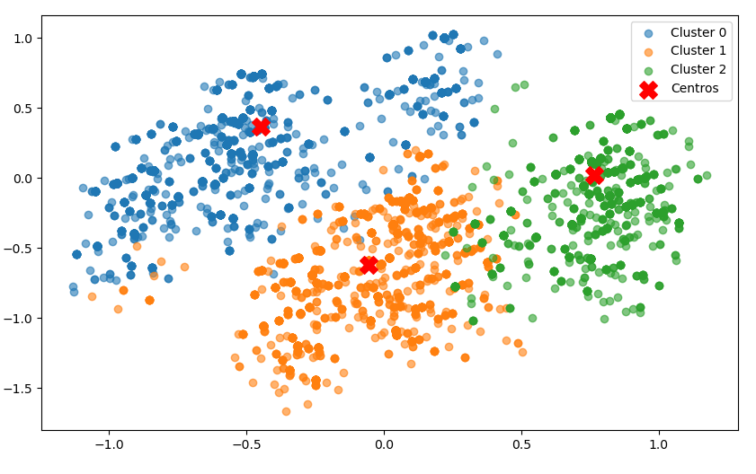

# **Projeto de Clustering de Filmes**  

Este projeto tem como objetivo agrupar filmes em clusters (grupos) com base em seus gêneros. O modelo aplica o algoritmo K-Means para realizar o clustering e utiliza PCA para reduzir a dimensionalidade dos dados e visualizar os grupos.  

## **Dataset**  

- [Fonte do dataset usado](https://grouplens.org/datasets/movielens/)  

---

## **O que o modelo faz?**  

O modelo realiza as seguintes etapas:  

1. **Pré-processamento dos dados**:  
   - Lida com valores nulos em colunas relevantes.  

2. **Criação de features**:  
   - Converte os gêneros dos filmes em variáveis dummy (one-hot encoding).  

3. **Clustering**:  
   - Aplica o algoritmo K-Means para agrupar os filmes em clusters com base nos gêneros.  
   - Atribui um rótulo de cluster a cada filme.  

4. **Visualização dos clusters**:  
   - Reduz a dimensionalidade das features usando PCA para projetá-las em um espaço bidimensional.  
   - Gera um gráfico de dispersão onde cada ponto representa um filme e as cores indicam os diferentes clusters.  
   - Os centros dos clusters são destacados com um marcador vermelho ("X").  

---

## **Como funciona?**  

O modelo utiliza as seguintes técnicas:  

- **One-Hot Encoding**:  
  - Transforma os gêneros dos filmes em colunas binárias, facilitando o clustering.  

- **K-Means**:  
  - Agrupa os filmes com base nos gêneros, buscando padrões de similaridade.  

- **PCA (Principal Component Analysis)**:  
  - Reduz a dimensionalidade dos dados para permitir a visualização dos clusters em 2D.  

---

## **Estrutura do Projeto**  

O projeto é dividido em dois scripts principais:  

1. **`merge_csv.py`**:  
   - Realiza o pré-processamento dos dados.  
   - Salva os dados pré-processados em `preprocessed_data.csv`.  

2. **`modelo.py`**:  
   - Carrega os dados pré-processados.  
   - Cria as features e aplica o modelo de clustering.  
   - Visualiza os clusters usando um gráfico.  
   - Salva os resultados em `movies_with_clusters.csv`.  

---

## **Como executar o projeto?**  

### **Pré-requisitos**  

- Python 3.x  
- Bibliotecas necessárias: `pandas`, `scikit-learn`, `scipy`, `numpy`, `matplotlib`  

Instale as dependências com:  

```bash
pip install pandas scikit-learn scipy numpy matplotlib
```  

### **Passos para execução**  

1. **Pré-processamento**:  
   - Execute o script `merge_csv.py` para processar os dados brutos e gerar o arquivo `preprocessed_data.csv`:  

     ```bash
     python merge_csv.py
     ```  

2. **Clustering e Visualização**:  
   - Execute o script `modelo.py` para aplicar o modelo de clustering e gerar o gráfico:  

     ```bash
     python modelo.py
     ```  

---

## **Visualização dos Clusters**  

O modelo gera um gráfico onde:  

- **Cada ponto representa um filme** e sua posição é determinada pelo PCA.  
- **As cores indicam os diferentes clusters** atribuídos pelo K-Means.  
- **Os centros dos clusters são marcados com um "X" vermelho**, representando os pontos centrais de cada grupo.  

Exemplo de gráfico gerado:  

  

---

## **Arquivos gerados**  

1. **`preprocessed_data.csv`**:  
   - Contém os dados pré-processados, incluindo:  
     - `movieId`: ID do filme.  
     - `title`: Título do filme.  
     - `genres`: Gêneros do filme.  

2. **`movies_with_clusters.csv`**:  
   - Contém os dados finais com os rótulos dos clusters:  
     - Todas as colunas de `preprocessed_data.csv`.  
     - `cluster`: Rótulo do cluster ao qual o filme pertence.  

---

## **Interpretação dos resultados**  

- **Clusters**:  
  - Cada cluster representa um grupo de filmes com gêneros semelhantes.  
  - Por exemplo:  
    - Cluster 0: Filmes de ação e aventura.  
    - Cluster 1: Filmes de drama.  
    - Cluster 2: Filmes de comédia.  

- **Análise**:  
  - O gráfico permite visualizar como os filmes estão distribuídos nos clusters.  
  - A proximidade entre os pontos pode indicar filmes com características semelhantes.  

---

## **Próximos passos**  

- **Otimização**:  
  - Ajustar o número de clusters (`n_clusters`) para melhorar a qualidade do agrupamento.  
  - Experimentar outros algoritmos de clustering, como DBSCAN ou Hierarchical Clustering.  

- **Melhoria na Visualização**:  
  - Testar diferentes técnicas de redução de dimensionalidade, como t-SNE ou UMAP.  

- **Expansão**:  
  - Integrar o modelo em um sistema de recomendação de filmes.  

---
